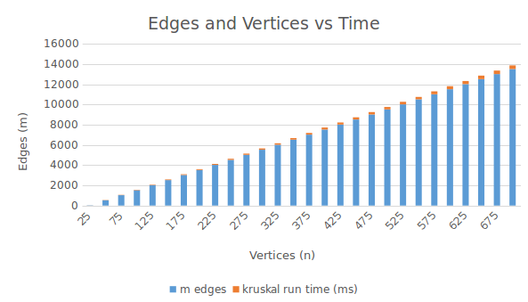
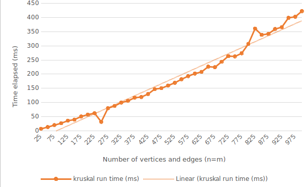
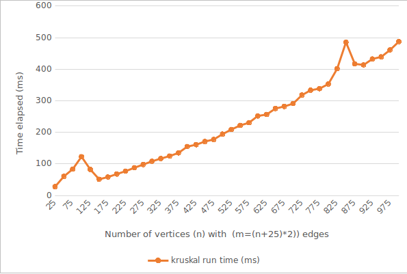
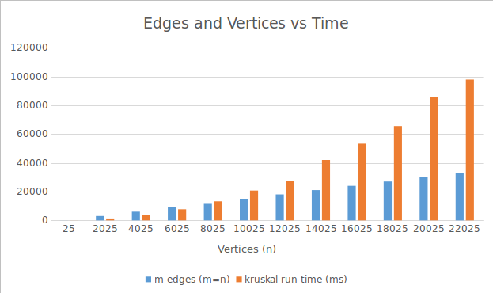

Kruskal's Algorithm Growth Rate
===============================

## John Harvey

### About - [Wiki](https://en.wikipedia.org/wiki/Kruskal%27s_algorithm "Kruskal's algorithm")
Kruskal's algorithm is a minimum-spanning-tree algorithm which finds an edge of the least possible weight that connects any two trees in the forest. It is a greedy algorithm in graph theory as it finds a minimum spanning tree for a connected weighted graph adding increasing cost arcs at each step.

### Install Notes - Ubuntu
1. Clone repo with git `git clone https://github.com/jharvey7136/kruskal_algorithm.git`
2. Navigate to the app's root directory through the terminal
3. Run program with command: `ruby run.rb`
4. Input number of vertices
5. Input number of edges
Time elapsed will be displayed in milliseconds

### Hypothesis
Kruskal’s algorithm has a time complexity of O(m log n)

### Test Design
In order to test the hypothesis involved, I have taken the following steps:

1. Implement Kruskal’s algorithm in Ruby
2. Run the code for multiple amounts of n and m items, also with various random weights
  * Test and gather data for when number of vertices = number of edges
  * Test again with higher range of random edge weight
  * Test and gather data for when there are more edges than vertices
  * Test again with higher range of random edge weight
3. Inspect the graphs and compare the growth to an m log n growth rate
4. Examine code and make changes if results do not seem right

### Evaluation of Data
How the data was generated: The user inputs a number for the amount of vertices, and the amount of edges. The edge weight is a randomly generated integer between 0 and any number you would like. I hard coded different edge weight ranges to reduce time. Multiple ranges of vertices, edges, and edge weights were done to achieve more accurate result. All data was logged in Excel.

### Conclusion
I discovered that Kruskals algorithm does in fact run in Big O(m log n). Every set of tested data ran in under m log n time. The time it takes grows as the vertices grow more than as the edges grow. Some tests even ran faster with more edges. I also discovered that increasing the range of the possible edge weight did not drastically change the time elapsed.

